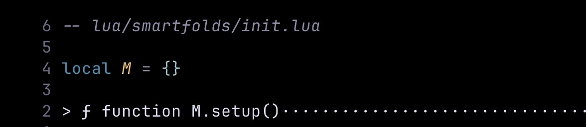

# smartfolds.nvim — Day 1: Parsing Folds and First Steps into Tree-sitter

Today marks **Day 1** of building my new Neovim plugin: **smartfolds.nvim**!

After feeling stuck for a while doing the same kinds of projects, I promised myself I would step outside my comfort zone. This project is my attempt at that: trying new things, exploring new tools, and maybe (hopefully!) finding that spark again.

And wow, today was **super exciting**. 🚀

---

## 🛠️ What I worked on today

The goal was simple (in theory):  
> "Get a rough version of fold parsing working."

In Neovim, folds usually just collapse code into a block and show a line filled with dots (······), which isn't super helpful when you're scrolling fast.

I want smartfolds.nvim to *actually understand* the code inside a fold and display something smart — like the function name and signature — instead of just the first random line.

Today, I managed to **parse the folded text** using **Treesitter**, and **extract the function signature** if a folded area contains a function! 🧠

---

## 📚 Things I learned today

- **`vim.v`**  
  I discovered that `vim.v` is a special table that holds Vim's predefined variables, like `vim.v.foldstart` and `vim.v.foldend`.  
  Super handy for working with folds!

- **Treesitter Basics**  
  This was my very first time playing with Treesitter.  
  I learned how to parse the syntax tree for the current buffer, iterate over nodes, and find things like function declarations.  
  It's still a bit magical to me, but I’m starting to get the hang of it.

---

## 🖼️ Here’s what it looks like so far

The fold text now shows a little function signature instead of boring dots.  
It's a small thing, but it already feels so much more powerful.

---

## 💬 Final thoughts

Honestly, today felt **amazing**.

It’s a small first step, but it reminded me why trying new things is so important.  
I have no idea if smartfolds.nvim will ever be "popular" or even "good," but I already feel proud that I started.

This is me getting unstuck, one fold at a time. (pun intended 😂)

---

Stay tuned for Day 2! 🚀
